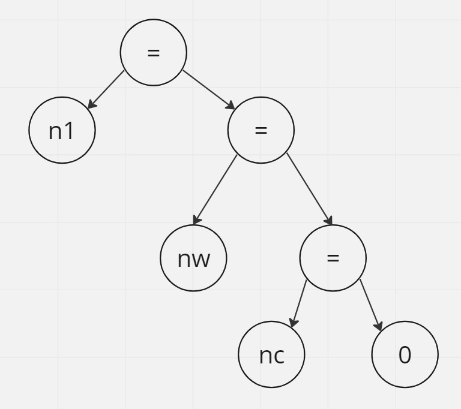
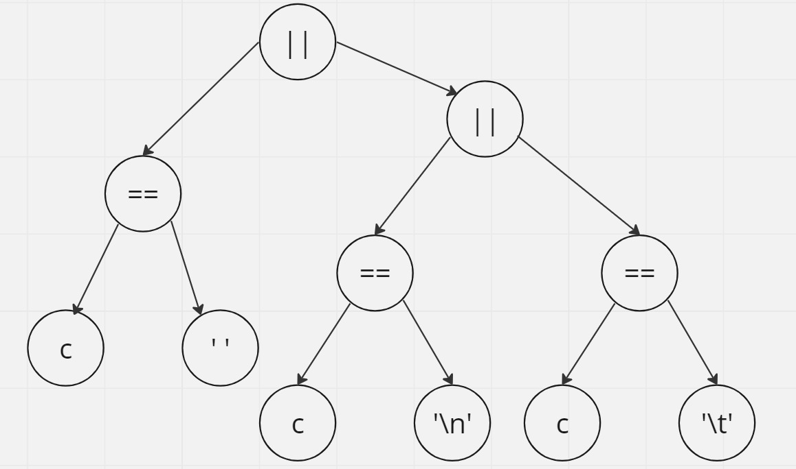

# TP2 Máquinas de Estado — Histograma de longitud de palabras
## Secuencia de Pasos
## 1.b)

## 1.c)

## 2.b) Formalizacion de la Maquina de estado:
M = (Q, Σ, δ, λ, q0)

Donde:
- Q = {IN, OUT} es el conjunto de estados
- Σ = todos los caracteres pertenecientes a ASCII es el alfabeto
- δ: Función de transiciónes:
    - δ(IN, no espaciador) = IN,
    - δ(IN, espaciador) = OUT,
    - δ(OUT, espaciador) = OUT,
    - δ(OUT,no espaciador) = IN,
- λ: Acciones realizadas durante las transiciones:
    - λ(IN, no espaciador) = contar caracter. aumenta en 1 la variable lp(lp++).
    - λ(IN, espaciador) = agregar palabra a longitudes, incrementa en 1 el contador en el arreglo longitudes.
    - λ(OUT, no espaciador) = resetear contador de caracteres, lo resetea a 1 el contador ( lp=1).
- q0 = OUT es el estado inicial.

## 3.a) 
## ii) Ventajas y desventajas
### Versión sección 1.5.4 de [KR1988]
- Mas simple: esta implementación utiliza un bucle while con condiciones y sentencias if, lo que la hace relativamente sencilla y fácil de entender.
- Fácil de leer: El código es directo y tiene una lógica lineal, lo que facilita la lectura y el seguimiento de la funcionalidad.
- Falta de modularidad: esta implementación utiliza variables globales para contar caracteres , lo que puede dificultar el mantenimiento y reutilización del código en otros contextos.

### Implementación enum-switch
- Modularidad: como esta implementación utiliza un enfoque basado en el uso de un switch y un enum para representar los diferentes estados; esto mejora la modularidad y facilita la extensión del código.
- Mayor complejidad: tiene mas complejidad el código en comparación con la anterior implementación.
- Eficiencia: esta implementacion involucra más verificaciones condicionales y una estructura de control más compleja, lo que podría llevar a una pequeña pérdida de rendimiento en comparación con la implementación anterior

## 3.b) 
## iv) Responder en readme.md: ¿Tiene alguna aplicación go to hoy en día? ¿Algún lenguaje moderno lo utiliza?

La aplicacion de goto va a depender del contexto y la situacion. Lo mas habitual es que se aplique para abandonar el procesamiento en alguna estructura de control fuertemente anidada como tambien salir de dos o mas ciclos a la vez.
No muchos lenguajes de alto nivel lo utilizan ya que presenta dificultades para poder seguir de forma adecuada el flujo del programa.

## 3.c)
## ii) Responder en readme.md: ¿Es necesario que las funciones accedan a contadores? Si es así, ¿cómo hacerlo?

En nuestra implementación, si es necesario que las funciones accedan a contadores. Por un lado porque forman parte del ciclo recursivo, lo que nos permite por ejemplo utilizarlos como indicador para saber cuando comienza o termina una palabra bajo el criterio elegido, por otra parte (utilizando como ejemplo el contador de caracteres) se inicializa e itera dentro de los dos ciclos recursivos utilizados, una vez para inicializarlo y reiniciarlo/finalizarlo, y otra para el propio conteo de caracteres.

## 3.d)
## i) Diseñar una nueva implementación e indicar en Readme.md cómo esa implementación representa los estados y cómo las transiciones.
La nueva implementacion representa al estado con una variable de tipo bool inicializada en false. Las transiciones de estado estan definidas por ifs anidados.

## 4) Pruebas de las implementaciones
i) Se debe compilar y ejecutar la implementacion seleccionada; para eso se ejecuta el comando:
~~~
make run{x}
~~~
siendo x el numero de implementacion la cual se desea seleccionar, por ejemplo para la implementacion 1:
~~~
make run1
~~~

ii) Se generara un archivo con nombre *resultado_obtenido.txt , para realizar la prueba se ejecuta el comando:
~~~
make test
~~~

iii) Finalmente para eliminar los archivos objetos y el ejecutable se utiliza el comando:
~~~
make clean
~~~

## 5) Benchmark test

| Implementacion 	| testKb.txt 	| testMb.txt 	| testGb.txt 	|
|:--------------:	|:----------:	|:----------:	|:----------:	|
|   enum-switch  	|     5.5    	|     480    	|    39253   	|
|      goto      	|      5     	|      -     	|      -     	|
|    recursiva   	|      -     	|      -     	|      -     	|
|      bool      	|     4.5    	|     470    	|    39590   	|

### Notas: 
- Los tiempos estan expresados en milisegundos. 
- Los archivos fueron de 100KB , 10MB y 1GB
- Las implementaciones que tienen **"-"** , es porque fallaron en procesar el archivo.